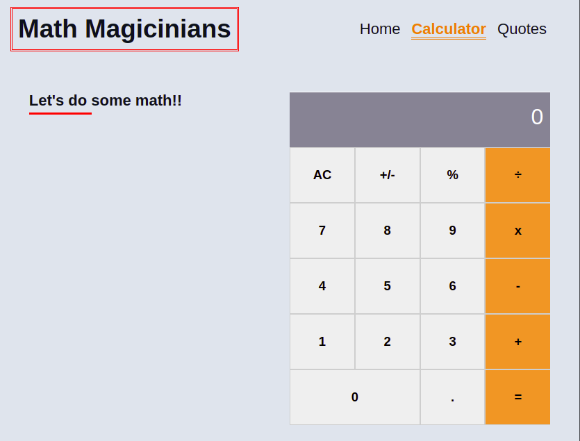

# Math magicians

This project was bootstrapped with [Create React App](https://github.com/facebook/create-react-app).

## Built With

This project is build with:

- 
- 
- 

## Live Demo

[Demo](https://tresorsawasawa.github.io/math_magicians/)

## Getting Started

To get the content of this project locally you need to run this command in your terminal:

- `git clone hhttps://github.com/tresorsawasawa/math_magicians.git`
- `cd math_magicians`
- `npm install` To download all the dependancies of the project
- Use `npm start` to run the app in live server

## Test

For tracking linter errors locally you need to follow these steps:

- After cloning the project make sure you have run this command

  > `npm install` command

- For tracking the linter errors in HTML file run:

  > `npx hint .`

- For tracking the linterj errors in CSS file run:

  > `npx stylelint "\*_/_.{css,scss}"`

- And For tracking the linter errors in JavaScript file run:

  > `npx eslint .`

- Use `npm run build` to run the app in live server

## Author

👤 **Tresor Sawasawa**

- GitHub: [@tresorsawasawa](https://github.com/tresorsawasawa)
- Twitter: [@tresorsawasawa](https://twitter.com/TresorSawasawa)
- LinkedIn: [Trésor Sawasawa](https://www.linkedin.com/in/tr%C3%A9sor-sawasawa-43745320b/)

## :handshake: Contributing

Feel free to check the [issues page](https://github.com/tresorsawasawa/math_magicians/issues)

## Show your support

Give a :star: if you like this project!

## Acknowledgments

- Thanks to everyone who will get time to check this code especially to code reviewers.

## 📝 License

This project is [MIT](./MIT.md) licensed.
